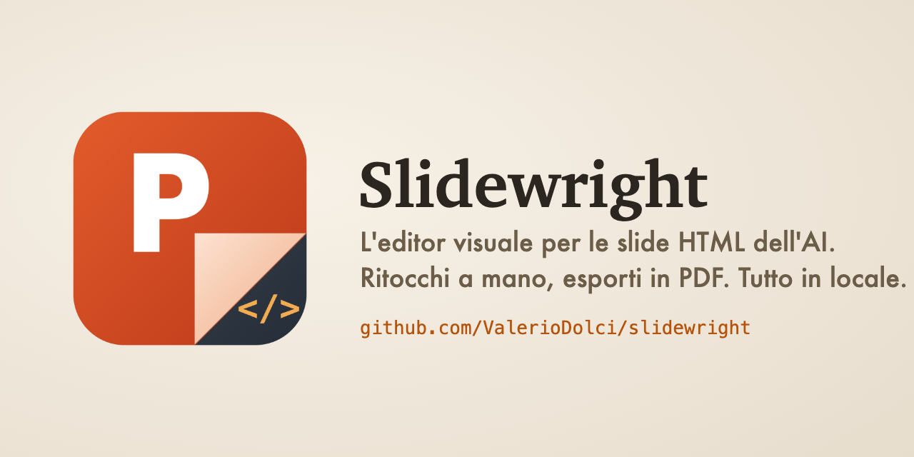
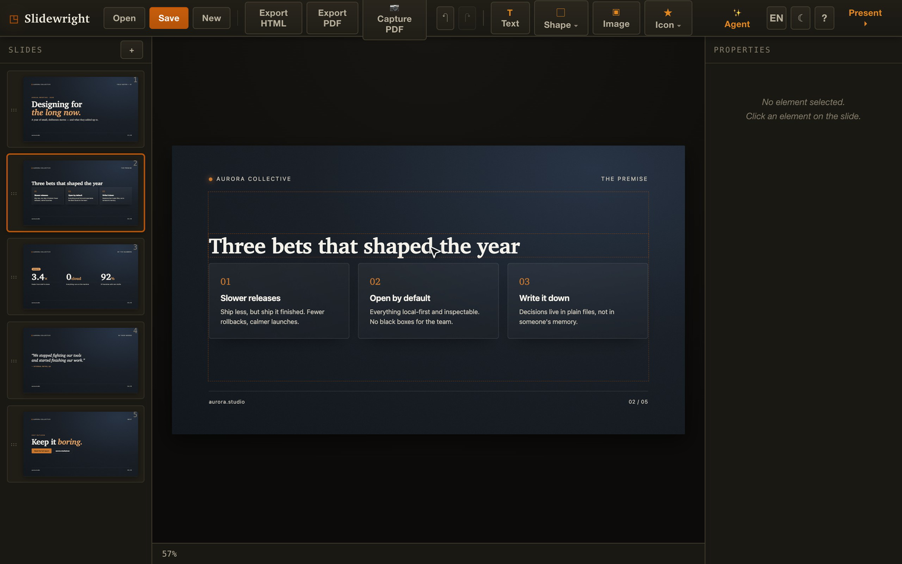

<p align="center">
  
</p>

<h1 align="center">Slidewright</h1>

<p align="center">
  <b>Edita i deck di slide HTML come in PowerPoint — 100% locale. Niente cloud, niente registrazione, niente upload.</b>
</p>

<p align="center">
  <a href="https://valeriodolci.github.io/slidewright/"><b>▶ Provalo live</b></a> ·
  <a href="https://github.com/ValerioDolci/slidewright/releases/latest/download/slidewright.html"><b>⬇ Scarica (1 file)</b></a> ·
  <a href="README.md">English</a>
</p>

<p align="center">
  <a href="https://github.com/ValerioDolci/slidewright/releases/latest"></a>
  <a href="LICENSE"></a>
  
  
</p>

<p align="center">
  <a href="https://valeriodolci.github.io/slidewright/"></a>
  <br />
  <a href="assets/demo.mp4"><b>▶ Guarda la demo di 8 secondi</b></a> · <a href="https://valeriodolci.github.io/slidewright/"><b>Provalo live</b></a>
</p>

---

## Perché Slidewright?

Chiedi a un'AI di "farti un deck di slide" e ti consegna un singolo file `.html`.
Bellissimo — finché non devi correggere un refuso, spostare un box o esportare un
PDF pulito. Oggi le opzioni sono: ri-promptare l'AI e sperare, oppure mettere mano
all'HTML grezzo a mano.

**Slidewright è l'editor visuale che manca per quei deck.** Apri l'`.html`,
trascini gli elementi come in PowerPoint, scrivi sopra il testo, esporti un HTML
pulito o un PDF 16:9 perfetto. Tutto gira nel browser, sul tuo computer — il deck
non lascia mai il tuo portatile.

- 🔒 **Local-first.** Niente server, niente account, niente telemetria, niente Google Fonts. Il file resta tuo.
- 🪶 **Zero dipendenze a runtime.** Un solo file HTML autoportante (~140 KB). Doppio-click e vai.
- 🎯 **Editing vero, non un viewer.** Sposta/ridimensiona/ruota, ricolora, ritaglia immagini in forme, undo/redo.
- 🖨 **Export pulito.** HTML standalone navigabile + PDF senza dipendenze (1 slide = 1 pagina, 16:9 reale).
- 🤝 **Due gusci, un motore.** Gira come web app *e* come estensione VS Code.

## Provalo in 30 secondi

1. **[Apri l'editor live](https://valeriodolci.github.io/slidewright/)** (non si carica nulla — gira nella tua scheda), **oppure**
2. **[Scarica `slidewright.html`](https://github.com/ValerioDolci/slidewright/releases/latest/download/slidewright.html)** e fai doppio-click — gira direttamente da `file://`.

Trascina un `deck.html` sulla finestra (o premi **Apri**) e inizia a editare.

## Uso

### Sviluppo (sorgenti modulari)
```bash
npm install
npm run dev        # http://localhost:5173
```

### Distribuzione (1 file, doppio-click, zero server)
```bash
npm run build:single   # → dist/index.html standalone (JS+CSS inlined)
```
Apri `dist/index.html` con un doppio click: l'editor gira da `file://`.

`npm run build` produce invece l'output multi-file in `dist/` (per debug).

### Estensione VS Code (slidewright)

Lo stesso editor gira anche come estensione VS Code (stesso `core`/`ui`, guscio
diverso). Apri un `.html` con **"Apri con… → Slidewright"** (opt-in: l'editor di
testo resta il default). Salvataggio = documento VS Code (dirty/⌘S/undo nativi);
la chat agente usa **Copilot via `vscode.lm`** (senza chiavi né CORS) con fallback
ai provider openai-compat chiamati dall'extension host.

```bash
npm run build:vscode          # bundla la webview in extension/media/
cd extension
npx @vscode/vsce package --no-dependencies   # → slidewright-<versione>.vsix
code --install-extension slidewright-0.1.0.vsix
```

## Cosa fa

| Livello | Funzione |
|---|---|
| **L1 — Riordino** | Miniature in sidebar, drag&drop (SortableJS), duplica / elimina / nuova |
| **L2 — Testo** | Doppio click su un elemento → `contenteditable` inline |
| **L3 — Grafica** | Click → selezione con maniglie move/resize/rotazione; pannello proprietà (font, dimensione, peso, colore, allineamento, sfondo, raggio, opacità, padding, z-index); aggiungi testo / forme / icone / immagine (ritaglio a forma); **undo/redo**; nudge con frecce |
| **Apri / Salva** | Apri un `.html` e **salva direttamente su quel file** (File System Access API, Chromium) con autosave; ⌘S. Fallback download su Firefox/Safari |
| **Clipboard** | ⌘C / ⌘V / ⌘D copia / incolla / duplica elemento; copia formato |
| **Tema** | Toggle chiaro/scuro (☾/☀), ricordato; il canvas mostra il deck col suo stile |
| **Export HTML** | Deck pulito, standalone, navigabile (frecce/click), ri-apribile dall'editor e da un'AI |
| **Export PDF** | Stampa browser con `@page` 16:9 (960×540pt) → 1 slide = 1 pagina, formato identico |
| **Import** | Trascina un `deck.html` (o "Apri"): parse di `<style>` + `<section class="slide">` |
| **Chat AI (opzionale)** | Agente provider-neutrale (OpenAI-compatibile: Mistral / OpenRouter / Ollama / LM Studio…; Copilot in VS Code) che edita il deck via tool call |

## Test

```bash
bash tests/run.sh          # regressione moduli core (python3 + Chrome, niente dep npm)
bash tests/run-webview.sh  # smoke del guscio VS Code: simula la webview (CSP reale +
                           # mock acquireVsCodeApi) e valida rendering + ciclo documento
```

## Architettura

Web vanilla (ES modules), nessun framework. **Lo stesso `core`/`ui` gira in due
gusci** grazie a un *platform layer* (host adapter): `web` (browser) e `vscode`
(webview dell'estensione). Build con Vite + `vite-plugin-singlefile`.

```
src/
  core/
    model.js        Modello dati Deck/Slide (JSON intermedio) + tema di default
    store.js        Stato centrale + history undo/redo (snapshot) + pub/sub
    import.js       deck.html → modello
    export-html.js  modello → HTML pulito (strip attributi editor + runtime nav)
    export-pdf.js   modello → stampa @page 16:9 (PDF dal browser)
    sanitize.js · assets.js · agent.js · llm.js     sicurezza, pool immagini, agente
  platform/
    index.js        Contratto Platform (host adapter): file/export/llm/storage/confirm
    web.js          Impl browser: File System Access, fetch LLM, window.print, localStorage
    vscode.js       Impl webview: RPC postMessage all'extension host; storage = stato webview
  ui/
    app.js          Orchestratore (host-agnostico: usa solo `platform`)
    layout.js       Markup workspace CONDIVISO web+webview (niente duplicazione)
    stage.js        Canvas <iframe> (isola gli stili del deck), scala, editing testo
    sidebar.js · selection.js · inspector.js · chat.js
  util/             dom, id
  styles/           tokens.css + editor.css ("Atelier drafting-cockpit")
apps/
  vscode/index.html Entry della webview (shell che monta `layout` + platform vscode)
extension/          Estensione VS Code (Node): Custom Editor + vscode.lm + messaging
  extension.js · package.json (manifest) · media/ (bundle webview, generato)
```

### Scelte di progetto
- **Canvas logico fisso 1280×720** (16:9), scalato a schermo: il drag in coordinate
  assolute è sicuro.
- **Modello JSON come fonte di verità**; il DOM nell'iframe è la *vista di editing*.
  Si serializza nel modello a ogni commit → undo/redo ed export robusti.
- **Undo/redo a snapshot** del modello (cap 120).
- **Elementi "liberi"**: un elemento in flusso viene convertito in `position:absolute`
  *congelando* la geometria attuale al primo move/resize (o via "Rendi libero"),
  così si abilita il posizionamento a mano senza rompere il layout importato.
- **Immagini in base64 inline** → deck autoportante in un solo file.
- **PDF senza dipendenze**: motore di stampa del browser (no Puppeteer/weasyprint).
  Nel dialogo di stampa attivare *"Grafica di sfondo"* per i fondali.

## Note
- Gli attributi interni dell'editor (`data-ss-eid`, `contenteditable`, classi `ss-*`)
  sono rimossi in fase di export: l'HTML in uscita è pulito.
- Target primario: i **deck** (`<section class="slide">`). I documenti HTML lunghi
  sono un caso secondario (importati come singola slide).

## Licenza

[MIT](LICENSE) © Valerio Dolci
